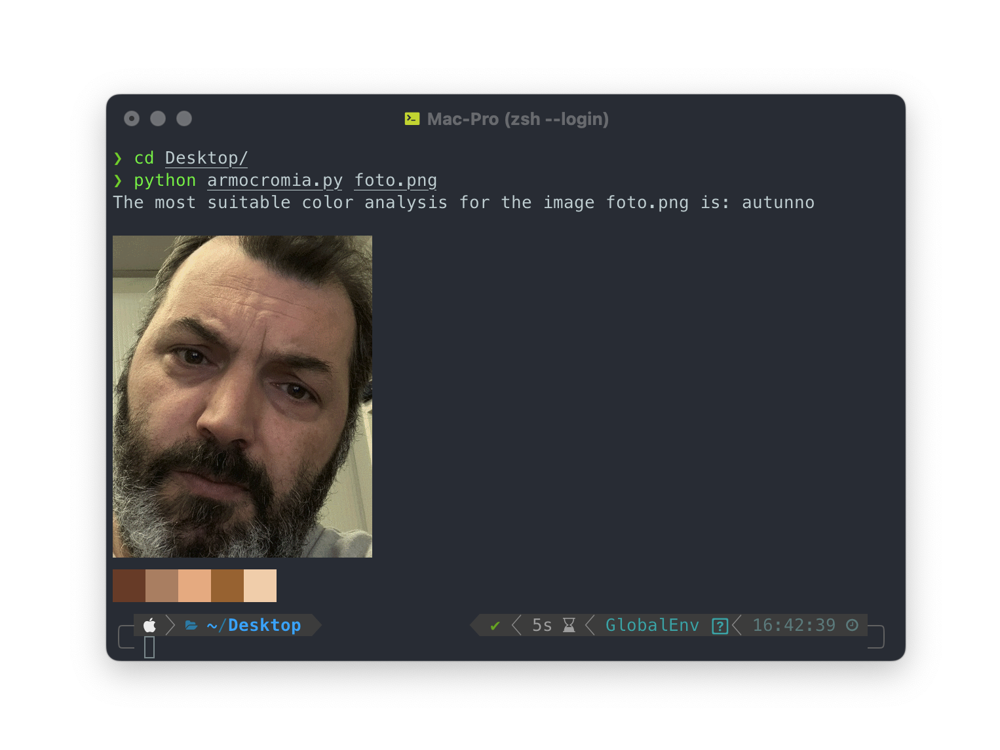

# Armocromia
Your personal color consultant:
Yo, nowadays people be needing an armocromia expert, but you know the costs be sky high... that's where the idea of a free virtual one comes in, giving everyone the chance to be happy and look fly in the perfect color.

## Installing Dependencies

To run the script, you need to install the required dependencies using the following command:

```bash
pip install -r requirements.txt
```
## Terminal Emulator Requirements

This script requires a terminal emulator that supports Sixel graphics, such as iTerm2 for macOS. Before running the script, ensure that you have a compatible terminal emulator installed on your system. For iTerm2 on macOS, you can download it from the official website: https://iterm2.com/

Additionally, you need to install img2sixel using your operating system's package manager. For example, on Debian/Ubuntu, you can use the following command:
```bash
sudo apt-get install libsixel-bin
```
On macOS, you can use the following command if you're using Homebrew:
```bash
brew install libsixel
```
## Running the Script
After installing all the dependencies, you can run the script with the following command:
```bash
python armocromia.py path_to_your_image

```

